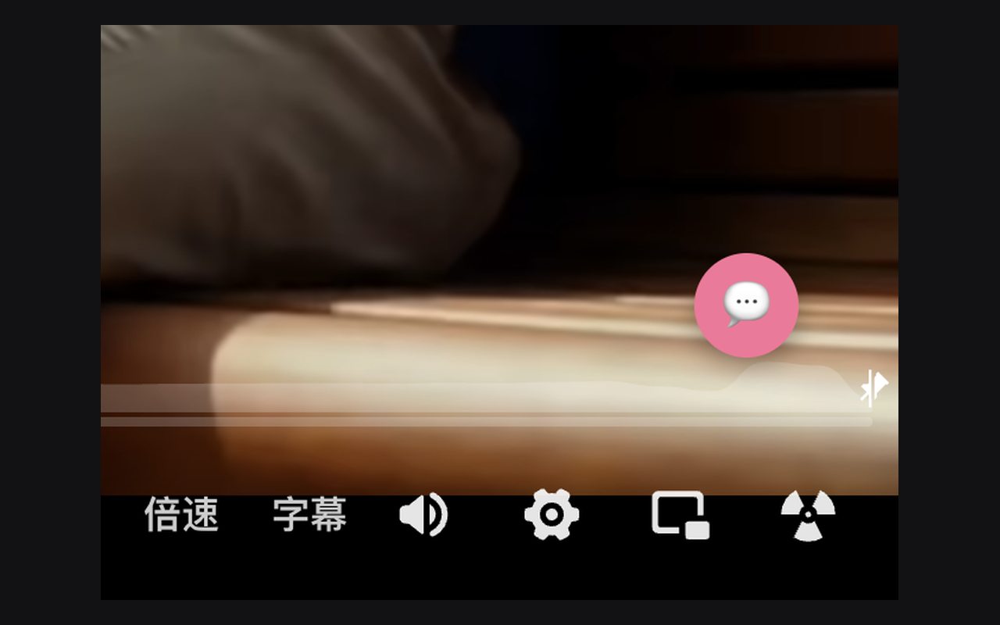
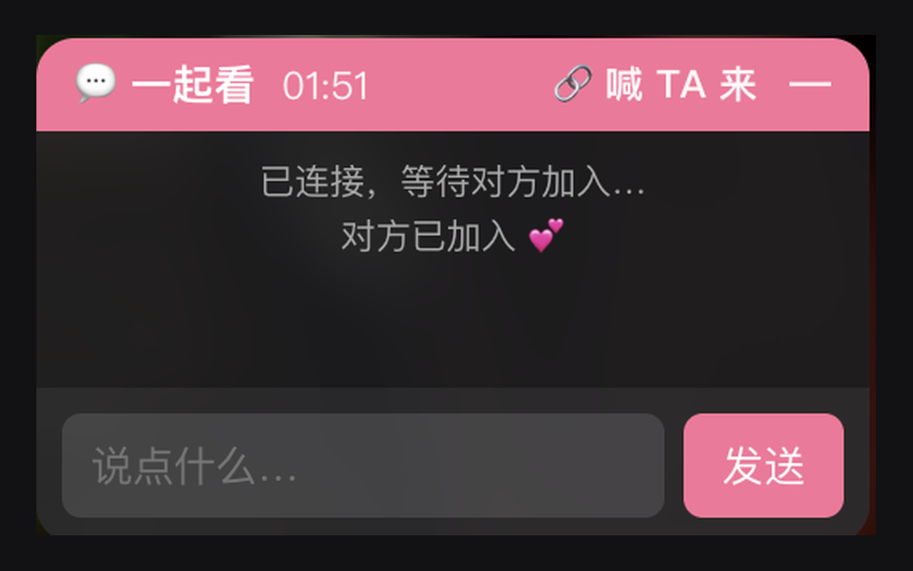
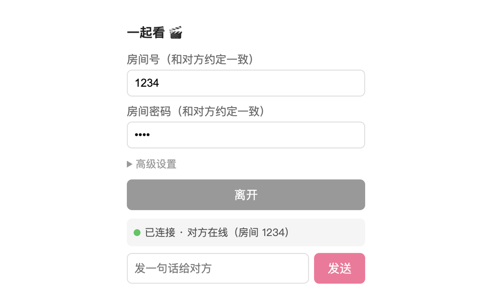
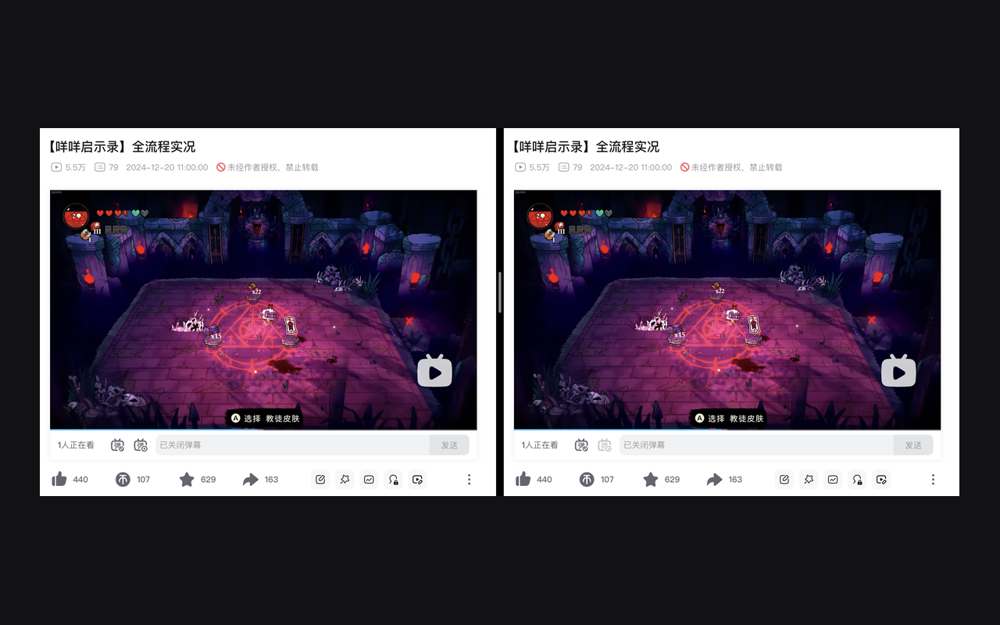

<div align="center">
  

  # 一起看

  远程一起看视频。支持 **B站 / 腾讯视频 / 爱奇艺**，同步播放、暂停、拖进度，附带文字消息。
</div>

## 截图

| 不遮挡画面的小圆标 | 边看边聊 |
| :---: | :---: |
|  |  |
| **填房间号密码加入** | **两边进度同步** |
|  |  |

## 原理

视频各看各的（各自的浏览器直接播放，画质不打折、不卡）。
两个浏览器插件只通过一台 WebSocket 中转服务同步「播放/暂停/跳进度」这几个控制信号——传的是几十字节的 JSON，带宽几乎为零。

```
你的浏览器  ──控制信号──►  WebSocket 中转服务  ──控制信号──►  对方的浏览器
   (本地播放视频)                (只转发指令)                (本地播放视频)
```

## 一、部署中转服务

插件已内置默认中转地址，**自己用的话这步可以跳过**。想部署自己的服务再往下看。

### 方案 A：Cloudflare Workers（推荐，免费且不休眠）

代码在 `cf-worker/`。免费计划够用：请求 10 万次/天，时长 13000 GB-s/天，
按每天看 5 小时算只占日额度的不到 1%。用了 Hibernation API，空闲时段不计时长费。

```bash
cd cf-worker
npm install
npx wrangler login      # 浏览器授权，需要 Cloudflare 账号（免费，不用绑卡）
npx wrangler deploy
```

首次部署若提示需要注册 workers.dev 子域，按输出里的链接去网页上起一个名字
（**注册后不可改**，会出现在你以后所有 Worker 的地址里）。

部署完得到 `https://watch-together.<你的子域>.workers.dev`，
插件里填的地址把开头换成 **wss://**：

```
wss://watch-together.<你的子域>.workers.dev
```

验证部署：`node test-remote.mjs wss://你的地址`（11 项检查，含转发、密码隔离、延迟）。

> 不需要买域名，`*.workers.dev` 是 Cloudflare 免费给的，自带 TLS。

### 方案 B：Render / Railway（Node 版，代码零改动）

代码在 `server/`，是等价的 Node + `ws` 实现。

- **Render**：New → Web Service → 选仓库 → Start Command 填 `node server.js`。
  免费实例空闲 15 分钟休眠，下次连接要等约 1 分钟唤醒。
- **Railway**：New Project → Deploy from GitHub repo → Settings → Root Directory 填 `server`，
  然后 Settings → Networking → Generate Domain。
  注意 Railway 试用期结束后降级到 Free 计划，每月只有 $1 额度，用完服务会停。

## 二、安装 Chrome 插件（每个人各装一次）

1. Chrome 地址栏打开 `chrome://extensions`
2. 右上角打开「开发者模式」
3. 点「加载已解压的扩展程序」，选择本项目的 `extension/` 文件夹
4. 把 `extension/` 文件夹发给一起看的人，照做一遍

## 三、一起看

1. 大家打开**同一个**视频页面（同一集、同一个清晰度最好）。
2. 点浏览器右上角的「一起看」插件图标。
3. 每个人填**相同**的：
   - 中转服务地址：留空即用内置默认；自建了服务才填，形如 `wss://watch-together.xxx.workers.dev`
   - 房间号：随便约定一个，比如 `我俩的小屋`（必须一致）
   - 房间密码：约定一个，比如 `0520`（必须一致，留空则无密码）
4. 都点「加入房间」。看到房间人数变化就成了。

> 密码怎么起作用：服务端按「房间号 + 密码」一起区分房间。密码不对的人即使猜中房间号，
> 也会被分到另一个房间，收不到你们的同步消息。服务端不保存密码。
5. 之后谁按暂停/播放/拖进度，两边同步。想说话直接在插件里发消息，或者另开个微信语音挂着。

## 常见问题

- **进度差一点点**：网络有延迟，正常。差超过 2.5 秒会自动对齐。手动拖一下进度条即可强制同步。
- **换集/换清晰度后不同步**：播放器会重建 video 元素，插件每 2 秒自动重新绑定；若没跟上，任意一方拖一下进度条触发一次同步即可。
- **点了加入没反应**：确认当前页面是 B站/腾讯/爱奇艺的**视频播放页**，不是首页。
- **腾讯视频/爱奇艺的广告**：贴片广告期间 video 元素和正片不是同一个，等广告放完进正片再一起点播放最稳。
- **自己开了几个视频页会算成几个人吗**：不会。同一浏览器不管开多少页都算一个人。

更多面向用户的说明见插件内的「怎么用？」（`extension/help.html`）。

## 项目结构

```
extension/     Chrome 插件（Manifest V3）
  content.js   注入视频页：找 video、连中转服务、双向同步、聊天面板
  popup.js     插件弹窗：房间配置、连接状态
  help.html    使用说明页
cf-worker/     Cloudflare Workers 版中转服务（推荐）
  src/index.js Durable Object，一个房间一个实例
server/        Node + ws 版中转服务（Render / Railway 用）
```

## 跑测试

测试不依赖测试框架，直接 `node` 执行。少数几个需要 `agent-browser` 命令，用于在真实视频页里验证 DOM 相关行为。

```bash
# 插件端
cd extension
for t in test-*.mjs; do echo "--- $t"; node "$t"; done

# 中转服务：本地
cd cf-worker && npm install
npx wrangler dev --port 8787 --local   # 另开一个终端
node test-local.mjs

# 中转服务：线上（打已部署的地址）
node test-remote.mjs wss://你的地址
node test-dedup.mjs  wss://你的地址
```

各文件覆盖的范围：

| 文件 | 验证内容 |
| --- | --- |
| `test-runtime.mjs` | 真正执行 content.js 走完加入流程，抓运行时错误 |
| `test-storage.mjs` | 中转地址的存取与旧地址迁移 |
| `test-messages.mjs` | 文案不出现「对方」、昵称注入、人数提示 |
| `test-anchor.mjs` | 面板与小圆标共享位置、默认位置在各视口的表现 |
| `test-panel.mjs` | 面板/圆标的创建与销毁，不残留不叠加 |
| `test-leave.mjs` | 跨标签页离开、说明页入口 |
| `test-frame-guard.mjs` | 同源 iframe 不重复注入（需 agent-browser） |
| `cf-worker/test-dedup.mjs` | 同一人多标签页按 clientId 去重计数 |
| `cf-worker/test-ghost.mjs` | presence 计数正确、消息不回显给自己 |
